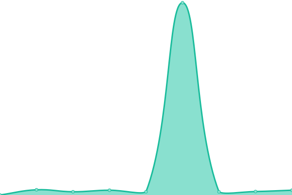
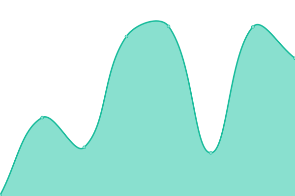

# [📈 Live Status](https://status.elfhosted.com): <!--live status--> **🟧 Partial outage**

This repository contains the open-source uptime monitor and status page for [Funky Penguin's Geek Cookbook](https://geek-cookbook.funkypenguin.co.nz), powered by [Upptime](https://github.com/upptime/upptime).

With [Upptime](https://upptime.js.org), you can get your own unlimited and free uptime monitor and status page, powered entirely by a GitHub repository. We use [Issues](https://github.com/geek-cookbook/elfhosted-upptime/issues) as incident reports, [Actions](https://github.com/geek-cookbook/elfhosted-upptime/actions) as uptime monitors, and [Pages](https://status.elfhosted.com) for the status page.

<!--start: status pages-->
<!-- This summary is generated by Upptime (https://github.com/upptime/upptime) -->
<!-- Do not edit this manually, your changes will be overwritten -->
<!-- prettier-ignore -->
| URL | Status | History | Response Time | Uptime |
| --- | ------ | ------- | ------------- | ------ |
|  [Video Hosting Platform](https://video.elfhosted.com) | 🟩 Up | [video-hosting-platform.yml](https://github.com/elfhosted/status.elfhosted.com/commits/HEAD/history/video-hosting-platform.yml) | 

 512ms
     
 | 

<a href="https://status.elfhosted.com/history/video-hosting-platform">88.20%</a>
    

|  Knightcrawler Stremio Addon | 🟩 Up | [knightcrawler-stremio-addon.yml](https://github.com/elfhosted/status.elfhosted.com/commits/HEAD/history/knightcrawler-stremio-addon.yml) | 

 2958ms
     
 | 

<a href="https://status.elfhosted.com/history/knightcrawler-stremio-addon">85.81%</a>
    

|  TorrentIO (not ElfHosted) Addon | 🟩 Up | [torrent-io-not-elf-hosted-addon.yml](https://github.com/elfhosted/status.elfhosted.com/commits/HEAD/history/torrent-io-not-elf-hosted-addon.yml) | 

 266ms
     
 | 

<a href="https://status.elfhosted.com/history/torrent-io-not-elf-hosted-addon">100.00%</a>
    

|  [Public Annatar Stremio Addon](https://annatar.elfhosted.com) | 🟩 Up | [public-annatar-stremio-addon.yml](https://github.com/elfhosted/status.elfhosted.com/commits/HEAD/history/public-annatar-stremio-addon.yml) | 

 699ms
     
 | 

<a href="https://status.elfhosted.com/history/public-annatar-stremio-addon">100.00%</a>
    

|  [Public Xtremio Stremio Addon](https://xtremio.elfhosted.com/configure) | 🟩 Up | [public-xtremio-stremio-addon.yml](https://github.com/elfhosted/status.elfhosted.com/commits/HEAD/history/public-xtremio-stremio-addon.yml) | 

 515ms
     
 | 

<a href="https://status.elfhosted.com/history/public-xtremio-stremio-addon">100.00%</a>
    

|  [Public MediaFusion Stremio Addon](https://mediafusion.elfhosted.com) | 🟩 Up | [public-media-fusion-stremio-addon.yml](https://github.com/elfhosted/status.elfhosted.com/commits/HEAD/history/public-media-fusion-stremio-addon.yml) | 

 412ms
     
 | 

<a href="https://status.elfhosted.com/history/public-media-fusion-stremio-addon">82.65%</a>
    

|  [Public Stremio-Jackett Addon](https://stremio-jackett.elfhosted.com) | 🟥 Down | [public-stremio-jackett-addon.yml](https://github.com/elfhosted/status.elfhosted.com/commits/HEAD/history/public-stremio-jackett-addon.yml) | 

 5239ms
     
 | 

<a href="https://status.elfhosted.com/history/public-stremio-jackett-addon">60.16%</a>
    

|  [Public Shluflix Stremio Addon](https://shluflix.elfhosted.com) | 🟩 Up | [public-shluflix-stremio-addon.yml](https://github.com/elfhosted/status.elfhosted.com/commits/HEAD/history/public-shluflix-stremio-addon.yml) | 

 410ms
     
 | 

<a href="https://status.elfhosted.com/history/public-shluflix-stremio-addon">100.00%</a>
    

|  [Public Stremify Stremio Addon](https://stremify.elfhosted.com) | 🟩 Up | [public-stremify-stremio-addon.yml](https://github.com/elfhosted/status.elfhosted.com/commits/HEAD/history/public-stremify-stremio-addon.yml) | 

 400ms
     
 | 

<a href="https://status.elfhosted.com/history/public-stremify-stremio-addon">92.84%</a>
    

|  [Public Jackettio Stremio Addon](https://jackettio.elfhosted.com) | 🟩 Up | [public-jackettio-stremio-addon.yml](https://github.com/elfhosted/status.elfhosted.com/commits/HEAD/history/public-jackettio-stremio-addon.yml) | 

 515ms
     
 | 

<a href="https://status.elfhosted.com/history/public-jackettio-stremio-addon">100.00%</a>
    

|  [Public Davio Stremio Addon](https://davio.elfhosted.com) | 🟩 Up | [public-davio-stremio-addon.yml](https://github.com/elfhosted/status.elfhosted.com/commits/HEAD/history/public-davio-stremio-addon.yml) | 

 508ms
     
 | 

<a href="https://status.elfhosted.com/history/public-davio-stremio-addon">77.44%</a>
    

|  [Public Stremio-Jackett Cache](https://stremio-jackett-cacher.elfhosted.com) | 🟩 Up | [public-stremio-jackett-cache.yml](https://github.com/elfhosted/status.elfhosted.com/commits/HEAD/history/public-stremio-jackett-cache.yml) | 

 363ms
     
 | 

<a href="https://status.elfhosted.com/history/public-stremio-jackett-cache">100.00%</a>
    

|  [Stremio CyberFlix Addon](https://cyberflix.elfhosted.com/c/catalogs=23aba,20794,5128d,7d1ea,671a9,cd492,15846,cf003,eba63,c4e72,071c0,47f38,71418,61f57,60f26,88681,a2ff4,7cc21,839a6,c9c76%7Clang=en/catalog/Kids/kids.new.movie.json) | 🟩 Up | [stremio-cyber-flix-addon.yml](https://github.com/elfhosted/status.elfhosted.com/commits/HEAD/history/stremio-cyber-flix-addon.yml) | 

 3390ms
     
 | 

<a href="https://status.elfhosted.com/history/stremio-cyber-flix-addon">60.42%</a>
    

|  [Store / Account Management Platform](https://store.elfhosted.com) | 🟩 Up | [store-account-management-platform.yml](https://github.com/elfhosted/status.elfhosted.com/commits/HEAD/history/store-account-management-platform.yml) | 

 916ms
     
 | 

<a href="https://status.elfhosted.com/history/store-account-management-platform">100.00%</a>
    

|  [Website / Docs](https://elfhosted.com) | 🟩 Up | [website-docs.yml](https://github.com/elfhosted/status.elfhosted.com/commits/HEAD/history/website-docs.yml) | 

 97ms
     
 | 

<a href="https://status.elfhosted.com/history/website-docs">100.00%</a>
    

<!--end: status pages-->

[**Visit our status website →**](https://status.elfhosted.com)

## 📄 License

- Powered by: [Upptime](https://github.com/upptime/upptime)
- Code: [MIT](./LICENSE) © [Funky Penguin's Geek Cookbook](https://geek-cookbook.funkypenguin.co.nz)
- Data in the `./history` directory: [Open Database License](https://opendatacommons.org/licenses/odbl/1-0/)
