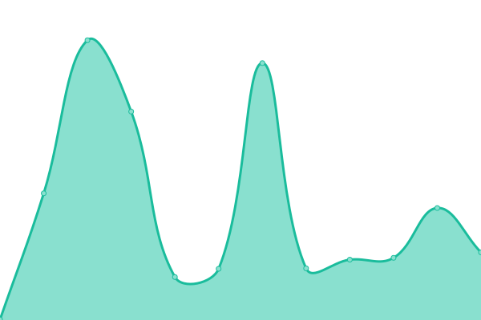

# [📈 Live Status](https://status.elfhosted.com): <!--live status--> **🟧 Partial outage**

This repository contains the open-source uptime monitor and status page for [Funky Penguin's Geek Cookbook](https://geek-cookbook.funkypenguin.co.nz), powered by [Upptime](https://github.com/upptime/upptime).

With [Upptime](https://upptime.js.org), you can get your own unlimited and free uptime monitor and status page, powered entirely by a GitHub repository. We use [Issues](https://github.com/geek-cookbook/elfhosted-upptime/issues) as incident reports, [Actions](https://github.com/geek-cookbook/elfhosted-upptime/actions) as uptime monitors, and [Pages](https://status.elfhosted.com) for the status page.

<!--start: status pages-->
<!-- This summary is generated by Upptime (https://github.com/upptime/upptime) -->
<!-- Do not edit this manually, your changes will be overwritten -->
<!-- prettier-ignore -->
| URL | Status | History | Response Time | Uptime |
| --- | ------ | ------- | ------------- | ------ |
|  [App Hosting Platform](https://speed.elfhosted.com) | 🟩 Up | [app-hosting-platform.yml](https://github.com/geek-cookbook/elfhosted-upptime/commits/HEAD/history/app-hosting-platform.yml) | 

 407ms
     
 | 

<a href="https://status.elfhosted.com/history/app-hosting-platform">100.00%</a>
    

|  [Public Torrentio Indexer / Addon](https://torrentio.elfhosted.com) | 🟩 Up | [public-torrentio-indexer-addon.yml](https://github.com/geek-cookbook/elfhosted-upptime/commits/HEAD/history/public-torrentio-indexer-addon.yml) | 

 684ms
     
 | 

<a href="https://status.elfhosted.com/history/public-torrentio-indexer-addon">99.40%</a>
    

|  [Public Annatar Stremio Addon](https://annatar.elfhosted.com) | 🟩 Up | [public-annatar-stremio-addon.yml](https://github.com/geek-cookbook/elfhosted-upptime/commits/HEAD/history/public-annatar-stremio-addon.yml) | 

 601ms
     
 | 

<a href="https://status.elfhosted.com/history/public-annatar-stremio-addon">100.00%</a>
    

|  [Public Xtremio Stremio Addon](https://xtremio.elfhosted.com/configure) | 🟩 Up | [public-xtremio-stremio-addon.yml](https://github.com/geek-cookbook/elfhosted-upptime/commits/HEAD/history/public-xtremio-stremio-addon.yml) | 

 583ms
     
 | 

<a href="https://status.elfhosted.com/history/public-xtremio-stremio-addon">100.00%</a>
    

|  [Public MediaFusion Stremio Addon](https://mediafusion.elfhosted.com) | 🟩 Up | [public-media-fusion-stremio-addon.yml](https://github.com/geek-cookbook/elfhosted-upptime/commits/HEAD/history/public-media-fusion-stremio-addon.yml) | 

 413ms
     
 | 

<a href="https://status.elfhosted.com/history/public-media-fusion-stremio-addon">100.00%</a>
    

|  [Public Stremio-Jackett Addon](https://stremio-jackett.elfhosted.com) | 🟥 Down | [public-stremio-jackett-addon.yml](https://github.com/geek-cookbook/elfhosted-upptime/commits/HEAD/history/public-stremio-jackett-addon.yml) | 

 640ms
     
 | 

<a href="https://status.elfhosted.com/history/public-stremio-jackett-addon">94.49%</a>
    

|  [Public Shluflix Stremio Addon](https://shluflix.elfhosted.com) | 🟩 Up | [public-shluflix-stremio-addon.yml](https://github.com/geek-cookbook/elfhosted-upptime/commits/HEAD/history/public-shluflix-stremio-addon.yml) | 

 424ms
     
 | 

<a href="https://status.elfhosted.com/history/public-shluflix-stremio-addon">100.00%</a>
    

|  [Public Stremify Stremio Addon](https://stremify.elfhosted.com) | 🟩 Up | [public-stremify-stremio-addon.yml](https://github.com/geek-cookbook/elfhosted-upptime/commits/HEAD/history/public-stremify-stremio-addon.yml) | 

 359ms
     
 | 

<a href="https://status.elfhosted.com/history/public-stremify-stremio-addon">99.22%</a>
    

|  [Public Jackettio Stremio Addon](https://jackettio.elfhosted.com) | 🟩 Up | [public-jackettio-stremio-addon.yml](https://github.com/geek-cookbook/elfhosted-upptime/commits/HEAD/history/public-jackettio-stremio-addon.yml) | 

 638ms
     
 | 

<a href="https://status.elfhosted.com/history/public-jackettio-stremio-addon">97.23%</a>
    

|  [Public Stremio-Jackett Cache](https://stremio-jackett-cacher.elfhosted.com) | 🟩 Up | [public-stremio-jackett-cache.yml](https://github.com/geek-cookbook/elfhosted-upptime/commits/HEAD/history/public-stremio-jackett-cache.yml) | 

 391ms
     
 | 

<a href="https://status.elfhosted.com/history/public-stremio-jackett-cache">100.00%</a>
    

|  [Stremio CyberFlix Addon](https://cyberflix.elfhosted.com) | 🟩 Up | [stremio-cyber-flix-addon.yml](https://github.com/geek-cookbook/elfhosted-upptime/commits/HEAD/history/stremio-cyber-flix-addon.yml) | 

 482ms
     
 | 

<a href="https://status.elfhosted.com/history/stremio-cyber-flix-addon">100.00%</a>
    

|  [Store / Account Management Platform](https://store.elfhosted.com) | 🟩 Up | [store-account-management-platform.yml](https://github.com/geek-cookbook/elfhosted-upptime/commits/HEAD/history/store-account-management-platform.yml) | 

 683ms
     
 | 

<a href="https://status.elfhosted.com/history/store-account-management-platform">100.00%</a>
    

|  [Website / Docs](https://elfhosted.com) | 🟩 Up | [website-docs.yml](https://github.com/geek-cookbook/elfhosted-upptime/commits/HEAD/history/website-docs.yml) | 

 103ms
     
 | 

<a href="https://status.elfhosted.com/history/website-docs">100.00%</a>
    

<!--end: status pages-->

[**Visit our status website →**](https://status.elfhosted.com)

## 📄 License

- Powered by: [Upptime](https://github.com/upptime/upptime)
- Code: [MIT](./LICENSE) © [Funky Penguin's Geek Cookbook](https://geek-cookbook.funkypenguin.co.nz)
- Data in the `./history` directory: [Open Database License](https://opendatacommons.org/licenses/odbl/1-0/)
