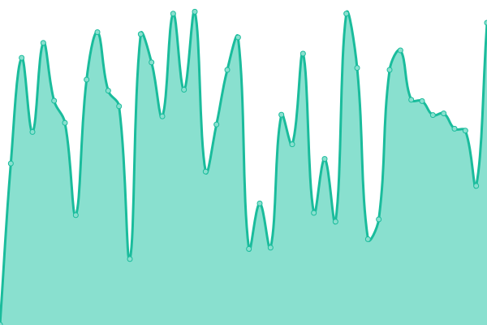

# [📈 Live Status](https://status.elfhosted.com): <!--live status--> **🟧 Partial outage**

This repository contains the open-source uptime monitor and status page for [Funky Penguin's Geek Cookbook](https://geek-cookbook.funkypenguin.co.nz), powered by [Upptime](https://github.com/upptime/upptime).

With [Upptime](https://upptime.js.org), you can get your own unlimited and free uptime monitor and status page, powered entirely by a GitHub repository. We use [Issues](https://github.com/geek-cookbook/elfhosted-upptime/issues) as incident reports, [Actions](https://github.com/geek-cookbook/elfhosted-upptime/actions) as uptime monitors, and [Pages](https://status.elfhosted.com) for the status page.

<!--start: status pages-->
<!-- This summary is generated by Upptime (https://github.com/upptime/upptime) -->
<!-- Do not edit this manually, your changes will be overwritten -->
<!-- prettier-ignore -->
| URL | Status | History | Response Time | Uptime |
| --- | ------ | ------- | ------------- | ------ |
|  [Video Hosting Platform](https://video.elfhosted.com) | 🟩 Up | [video-hosting-platform.yml](https://github.com/elfhosted/status.elfhosted.com/commits/HEAD/history/video-hosting-platform.yml) | 

 544ms
     
 | 

<a href="https://status.elfhosted.com/history/video-hosting-platform">99.91%</a>
    

|  [Knightcrawler Stremio Addon](https://knightcrawler.elfhosted.com/stream/movie/tt0023694.json) | 🟩 Up | [knightcrawler-stremio-addon.yml](https://github.com/elfhosted/status.elfhosted.com/commits/HEAD/history/knightcrawler-stremio-addon.yml) | 

 477ms
     
 | 

<a href="https://status.elfhosted.com/history/knightcrawler-stremio-addon">99.92%</a>
    

|  TorrentIO (not ElfHosted) Addon | 🟩 Up | [torrent-io-not-elf-hosted-addon.yml](https://github.com/elfhosted/status.elfhosted.com/commits/HEAD/history/torrent-io-not-elf-hosted-addon.yml) | 

 216ms
     
 | 

<a href="https://status.elfhosted.com/history/torrent-io-not-elf-hosted-addon">100.00%</a>
    

|  [Comet Stremio Addon](https://comet.elfhosted.com) | 🟩 Up | [comet-stremio-addon.yml](https://github.com/elfhosted/status.elfhosted.com/commits/HEAD/history/comet-stremio-addon.yml) | 

 812ms
     
 | 

<a href="https://status.elfhosted.com/history/comet-stremio-addon">99.32%</a>
    

|  [YourIPTV Stremio Addon (not ElfHosted)](https://youriptv.hayd.uk/configure) | 🟩 Up | [your-iptv-stremio-addon-not-elf-hosted.yml](https://github.com/elfhosted/status.elfhosted.com/commits/HEAD/history/your-iptv-stremio-addon-not-elf-hosted.yml) | 

 599ms
     
 | 

<a href="https://status.elfhosted.com/history/your-iptv-stremio-addon-not-elf-hosted">99.93%</a>
    

|  [Stremify Stremio Addon (not ElfHosted)](https://stremify.hayd.uk/configure) | 🟩 Up | [stremify-stremio-addon-not-elf-hosted.yml](https://github.com/elfhosted/status.elfhosted.com/commits/HEAD/history/stremify-stremio-addon-not-elf-hosted.yml) | 

 722ms
     
 | 

<a href="https://status.elfhosted.com/history/stremify-stremio-addon-not-elf-hosted">100.00%</a>
    

|  [Formulio Stremio Addon (not ElfHosted)](https://formulio.hayd.uk/) | 🟩 Up | [formulio-stremio-addon-not-elf-hosted.yml](https://github.com/elfhosted/status.elfhosted.com/commits/HEAD/history/formulio-stremio-addon-not-elf-hosted.yml) | 

 688ms
     
 | 

<a href="https://status.elfhosted.com/history/formulio-stremio-addon-not-elf-hosted">100.00%</a>
    

|  [EasyNews+ Stremio Addon](https://easynewsplus.elfhosted.com/configure) | 🟩 Up | [easy-news-stremio-addon.yml](https://github.com/elfhosted/status.elfhosted.com/commits/HEAD/history/easy-news-stremio-addon.yml) | 

 477ms
     
 | 

<a href="https://status.elfhosted.com/history/easy-news-stremio-addon">100.00%</a>
    

|  [MediaFusion Stremio Addon](https://mediafusion.elfhosted.com/health) | 🟩 Up | [media-fusion-stremio-addon.yml](https://github.com/elfhosted/status.elfhosted.com/commits/HEAD/history/media-fusion-stremio-addon.yml) | 

 504ms
     
 | 

<a href="https://status.elfhosted.com/history/media-fusion-stremio-addon">99.21%</a>
    

|  [StremThru Stremio Addons](https://stremthru.elfhosted.com) | 🟩 Up | [strem-thru-stremio-addons.yml](https://github.com/elfhosted/status.elfhosted.com/commits/HEAD/history/strem-thru-stremio-addons.yml) | 

 305ms
     
 | 

<a href="https://status.elfhosted.com/history/strem-thru-stremio-addons">100.00%</a>
    

|  [StremThru Stremio Addons](https://stremthru.elfhosted.com) | 🟩 Up | [strem-thru-stremio-addons.yml](https://github.com/elfhosted/status.elfhosted.com/commits/HEAD/history/strem-thru-stremio-addons.yml) | 

 305ms
     
 | 

<a href="https://status.elfhosted.com/history/strem-thru-stremio-addons">100.00%</a>
    

|  [AIOStreams Stremio Addons](https://aiostreams.elfhosted.com) | 🟩 Up | [aio-streams-stremio-addons.yml](https://github.com/elfhosted/status.elfhosted.com/commits/HEAD/history/aio-streams-stremio-addons.yml) | 

 1013ms
     
 | 

<a href="https://status.elfhosted.com/history/aio-streams-stremio-addons">100.00%</a>
    

|  [Stremio-Jackett Addon](https://stremio-jackett.elfhosted.com) | 🟥 Down | [stremio-jackett-addon.yml](https://github.com/elfhosted/status.elfhosted.com/commits/HEAD/history/stremio-jackett-addon.yml) | 

 3319ms
     
 | 

<a href="https://status.elfhosted.com/history/stremio-jackett-addon">98.83%</a>
    

|  [Zilean](https://zilean.elfhosted.com/healthchecks/ping) | 🟩 Up | [zilean.yml](https://github.com/elfhosted/status.elfhosted.com/commits/HEAD/history/zilean.yml) | 

 284ms
     
 | 

<a href="https://status.elfhosted.com/history/zilean">100.00%</a>
    

|  Jackettio Stremio Addon | 🟩 Up | [jackettio-stremio-addon.yml](https://github.com/elfhosted/status.elfhosted.com/commits/HEAD/history/jackettio-stremio-addon.yml) | 

 1750ms
     
 | 

<a href="https://status.elfhosted.com/history/jackettio-stremio-addon">99.71%</a>
    

|  [Davio Stremio Addon](https://davio.elfhosted.com) | 🟩 Up | [davio-stremio-addon.yml](https://github.com/elfhosted/status.elfhosted.com/commits/HEAD/history/davio-stremio-addon.yml) | 

 618ms
     
 | 

<a href="https://status.elfhosted.com/history/davio-stremio-addon">100.00%</a>
    

|  [Stremio-Jackett Cache](https://stremio-jackett-cacher.elfhosted.com) | 🟩 Up | [stremio-jackett-cache.yml](https://github.com/elfhosted/status.elfhosted.com/commits/HEAD/history/stremio-jackett-cache.yml) | 

 415ms
     
 | 

<a href="https://status.elfhosted.com/history/stremio-jackett-cache">100.00%</a>
    

|  [Stremio CyberFlix Addon](https://cyberflix.elfhosted.com/health) | 🟩 Up | [stremio-cyber-flix-addon.yml](https://github.com/elfhosted/status.elfhosted.com/commits/HEAD/history/stremio-cyber-flix-addon.yml) | 

 902ms
     
 | 

<a href="https://status.elfhosted.com/history/stremio-cyber-flix-addon">97.92%</a>
    

|  [Stremio TMDB Addon](https://tmdb.elfhosted.com/configure) | 🟩 Up | [stremio-tmdb-addon.yml](https://github.com/elfhosted/status.elfhosted.com/commits/HEAD/history/stremio-tmdb-addon.yml) | 

 607ms
     
 | 

<a href="https://status.elfhosted.com/history/stremio-tmdb-addon">100.00%</a>
    

|  [Speed Test Endpoint US-WA](https://eagle02-speed.elfhosted.cc/empty.php) | 🟩 Up | [speed-test-endpoint-us-wa.yml](https://github.com/elfhosted/status.elfhosted.com/commits/HEAD/history/speed-test-endpoint-us-wa.yml) | 

 258ms
     
 | 

<a href="https://status.elfhosted.com/history/speed-test-endpoint-us-wa">100.00%</a>
    

|  [Speed Test Endpoint DE-FSN](https://fairy01-speed.elfhosted.com/empty.php) | 🟩 Up | [speed-test-endpoint-de-fsn.yml](https://github.com/elfhosted/status.elfhosted.com/commits/HEAD/history/speed-test-endpoint-de-fsn.yml) | 

 408ms
     
 | 

<a href="https://status.elfhosted.com/history/speed-test-endpoint-de-fsn">99.78%</a>
    

|  [Store / Account Management Platform](https://store.elfhosted.com) | 🟩 Up | [store-account-management-platform.yml](https://github.com/elfhosted/status.elfhosted.com/commits/HEAD/history/store-account-management-platform.yml) | 

 431ms
     
 | 

<a href="https://status.elfhosted.com/history/store-account-management-platform">100.00%</a>
    

|  [Website / Docs](https://docs.elfhosted.com) | 🟩 Up | [website-docs.yml](https://github.com/elfhosted/status.elfhosted.com/commits/HEAD/history/website-docs.yml) | 

 140ms
     
 | 

<a href="https://status.elfhosted.com/history/website-docs">100.00%</a>
    

<!--end: status pages-->

[**Visit our status website →**](https://status.elfhosted.com)

## 📄 License

- Powered by: [Upptime](https://github.com/upptime/upptime)
- Code: [MIT](./LICENSE) © [Funky Penguin's Geek Cookbook](https://geek-cookbook.funkypenguin.co.nz)
- Data in the `./history` directory: [Open Database License](https://opendatacommons.org/licenses/odbl/1-0/)
