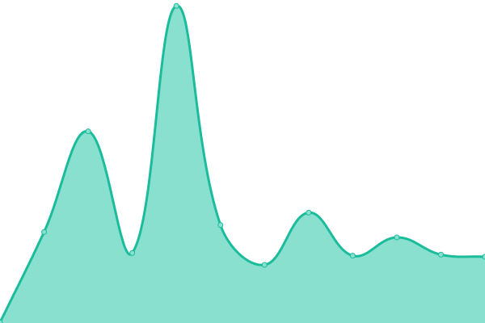

# [📈 Live Status](https://status.elfhosted.com): <!--live status--> **🟧 Partial outage**

This repository contains the open-source uptime monitor and status page for [Funky Penguin's Geek Cookbook](https://geek-cookbook.funkypenguin.co.nz), powered by [Upptime](https://github.com/upptime/upptime).

With [Upptime](https://upptime.js.org), you can get your own unlimited and free uptime monitor and status page, powered entirely by a GitHub repository. We use [Issues](https://github.com/geek-cookbook/elfhosted-upptime/issues) as incident reports, [Actions](https://github.com/geek-cookbook/elfhosted-upptime/actions) as uptime monitors, and [Pages](https://status.elfhosted.com) for the status page.

<!--start: status pages-->
<!-- This summary is generated by Upptime (https://github.com/upptime/upptime) -->
<!-- Do not edit this manually, your changes will be overwritten -->
<!-- prettier-ignore -->
| URL | Status | History | Response Time | Uptime |
| --- | ------ | ------- | ------------- | ------ |
|  [Video Hosting Platform](https://video.elfhosted.com) | 🟥 Down | [video-hosting-platform.yml](https://github.com/elfhosted/status.elfhosted.com/commits/HEAD/history/video-hosting-platform.yml) | 

 591ms
     
 | 

<a href="https://status.elfhosted.com/history/video-hosting-platform">99.87%</a>
    

|  Knightcrawler Stremio Addon | 🟥 Down | [knightcrawler-stremio-addon.yml](https://github.com/elfhosted/status.elfhosted.com/commits/HEAD/history/knightcrawler-stremio-addon.yml) | 

 1851ms
     
 | 

<a href="https://status.elfhosted.com/history/knightcrawler-stremio-addon">100.00%</a>
    

|  TorrentIO (not ElfHosted) Addon | 🟩 Up | [torrent-io-not-elf-hosted-addon.yml](https://github.com/elfhosted/status.elfhosted.com/commits/HEAD/history/torrent-io-not-elf-hosted-addon.yml) | 

 479ms
     
 | 

<a href="https://status.elfhosted.com/history/torrent-io-not-elf-hosted-addon">100.00%</a>
    

|  Annatar Stremio Addon | 🟥 Down | [annatar-stremio-addon.yml](https://github.com/elfhosted/status.elfhosted.com/commits/HEAD/history/annatar-stremio-addon.yml) | 

 1951ms
     
 | 

<a href="https://status.elfhosted.com/history/annatar-stremio-addon">99.88%</a>
    

|  Comet Stremio Addon | 🟥 Down | [comet-stremio-addon.yml](https://github.com/elfhosted/status.elfhosted.com/commits/HEAD/history/comet-stremio-addon.yml) | 

 1077ms
     
 | 

<a href="https://status.elfhosted.com/history/comet-stremio-addon">98.48%</a>
    

|  [Xtremio Stremio Addon](https://xtremio.elfhosted.com/configure) | 🟥 Down | [xtremio-stremio-addon.yml](https://github.com/elfhosted/status.elfhosted.com/commits/HEAD/history/xtremio-stremio-addon.yml) | 

 575ms
     
 | 

<a href="https://status.elfhosted.com/history/xtremio-stremio-addon">100.00%</a>
    

|  MediaFusion Stremio Addon | 🟥 Down | [media-fusion-stremio-addon.yml](https://github.com/elfhosted/status.elfhosted.com/commits/HEAD/history/media-fusion-stremio-addon.yml) | 

 1294ms
     
 | 

<a href="https://status.elfhosted.com/history/media-fusion-stremio-addon">100.00%</a>
    

|  [Stremio-Jackett Addon](https://stremio-jackett.elfhosted.com) | 🟥 Down | [stremio-jackett-addon.yml](https://github.com/elfhosted/status.elfhosted.com/commits/HEAD/history/stremio-jackett-addon.yml) | 

 794ms
     
 | 

<a href="https://status.elfhosted.com/history/stremio-jackett-addon">99.18%</a>
    

|  [Shluflix Stremio Addon](https://shluflix.elfhosted.com) | 🟥 Down | [shluflix-stremio-addon.yml](https://github.com/elfhosted/status.elfhosted.com/commits/HEAD/history/shluflix-stremio-addon.yml) | 

 839ms
     
 | 

<a href="https://status.elfhosted.com/history/shluflix-stremio-addon">99.88%</a>
    

|  [Stremify Stremio Addon](https://stremify.elfhosted.com) | 🟥 Down | [stremify-stremio-addon.yml](https://github.com/elfhosted/status.elfhosted.com/commits/HEAD/history/stremify-stremio-addon.yml) | 

 444ms
     
 | 

<a href="https://status.elfhosted.com/history/stremify-stremio-addon">61.48%</a>
    

|  Jackettio Stremio Addon | 🟥 Down | [jackettio-stremio-addon.yml](https://github.com/elfhosted/status.elfhosted.com/commits/HEAD/history/jackettio-stremio-addon.yml) | 

 914ms
     
 | 

<a href="https://status.elfhosted.com/history/jackettio-stremio-addon">99.43%</a>
    

|  [Davio Stremio Addon](https://davio.elfhosted.com) | 🟥 Down | [davio-stremio-addon.yml](https://github.com/elfhosted/status.elfhosted.com/commits/HEAD/history/davio-stremio-addon.yml) | 

 613ms
     
 | 

<a href="https://status.elfhosted.com/history/davio-stremio-addon">100.00%</a>
    

|  [Stremio-Jackett Cache](https://stremio-jackett-cacher.elfhosted.com) | 🟥 Down | [stremio-jackett-cache.yml](https://github.com/elfhosted/status.elfhosted.com/commits/HEAD/history/stremio-jackett-cache.yml) | 

 402ms
     
 | 

<a href="https://status.elfhosted.com/history/stremio-jackett-cache">99.04%</a>
    

|  [Stremio CyberFlix Addon](https://cyberflix.elfhosted.com/health) | 🟥 Down | [stremio-cyber-flix-addon.yml](https://github.com/elfhosted/status.elfhosted.com/commits/HEAD/history/stremio-cyber-flix-addon.yml) | 

 404ms
     
 | 

<a href="https://status.elfhosted.com/history/stremio-cyber-flix-addon">68.00%</a>
    

|  [Store / Account Management Platform](https://store.elfhosted.com) | 🟩 Up | [store-account-management-platform.yml](https://github.com/elfhosted/status.elfhosted.com/commits/HEAD/history/store-account-management-platform.yml) | 

 1054ms
     
 | 

<a href="https://status.elfhosted.com/history/store-account-management-platform">100.00%</a>
    

|  [Website / Docs](https://elfhosted.com) | 🟩 Up | [website-docs.yml](https://github.com/elfhosted/status.elfhosted.com/commits/HEAD/history/website-docs.yml) | 

 143ms
     
 | 

<a href="https://status.elfhosted.com/history/website-docs">100.00%</a>
    

<!--end: status pages-->

[**Visit our status website →**](https://status.elfhosted.com)

## 📄 License

- Powered by: [Upptime](https://github.com/upptime/upptime)
- Code: [MIT](./LICENSE) © [Funky Penguin's Geek Cookbook](https://geek-cookbook.funkypenguin.co.nz)
- Data in the `./history` directory: [Open Database License](https://opendatacommons.org/licenses/odbl/1-0/)
